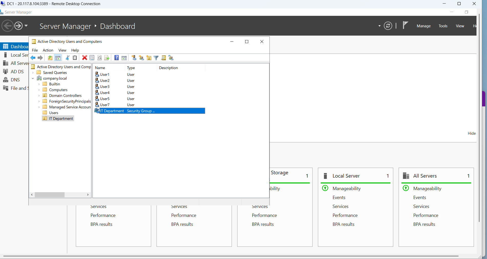

# Windows Server & Active Directory Home Lab

## Overview
I built a functional Active Directory environment on Microsoft Azure to learn enterprise Windows infrastructure management and systems administration. This lab demonstrates hands-on experience with core IT operations tasks including Active Directory administration, user and group management, and domain controller configuration.

## Architecture
- **Platform:** Microsoft Azure (IaaS)
- **Operating System:** Windows Server 2022 Datacenter
- **VM Size:** B2s (2 vCPU, 4GB RAM)
- **Domain Name:** company.local
- **Role:** Domain Controller

## What I've Set Up

### Active Directory Infrastructure
- Created a new Active Directory forest with domain "company.local"
- Promoted Windows Server 2022 to Domain Controller
- Installed and configured Active Directory Domain Services
- Configured DNS services for domain resolution

### Organizational Structure
- **IT Department** Organizational Unit (OU)
- Established directory structure for managing users and resources

### Users Created
- User1 (member of IT Department)
- User2 (member of IT Department)
- User3 (member of IT Department)
- User4
- User5
- User6
- User7

**Total:** 7 user accounts for testing and learning

### Groups Created
- **IT Department** (Security Group)
  - Members: User1, User2, User3

### Key Configurations
- Promoted Windows Server 2022 to Domain Controller
- Installed Active Directory Domain Services
- Configured DNS for domain name resolution
- Created and organized users in OUs
- Established security group with multiple members
- Implemented basic user account structure for enterprise environment

## Skills Demonstrated
- Active Directory Domain Services installation and configuration
- Domain controller deployment and management
- User account creation and management in AD
- Organizational Unit design and implementation
- Security group creation and membership management
- Windows Server administration using Server Manager console
- Active Directory Users & Computers MMC snap-in
- Domain naming and DNS integration
- Basic enterprise IT infrastructure understanding

## Screenshots

*Screenshot showing the company.local domain structure, IT Department OU, and IT Department security group with User1, User2, and User3 as members*

## What I'm Learning
- How Active Directory authenticates and authorizes users across a domain
- How organizational structures (OUs) organize users, computers, and resources
- How security groups manage ac
