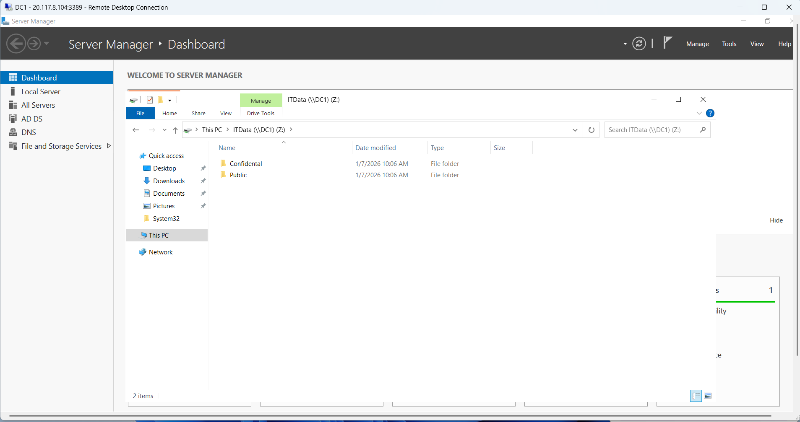
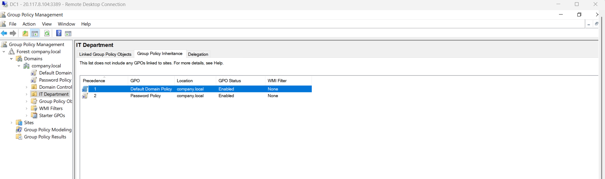

# Windows Server & Active Directory Home Lab

## Overview
I built a functional Active Directory environment on Microsoft Azure to learn enterprise Windows infrastructure management and systems administration. This hands-on lab demonstrates core IT operations skills including Active Directory administration, user and group management, NTFS permissions, Group Policy configuration, and domain controller deployment.

## Architecture
- **Platform:** Microsoft Azure (IaaS)
- **Operating System:** Windows Server 2022 Datacenter
- **VM Name:** DC1
- **VM Size:** B2s (2 vCPU, 4GB RAM)
- **Domain Name:** company.local
- **Role:** Domain Controller
- **IP Address:** 20.117.8.104

## What I've Built

### Active Directory Infrastructure
- Created a new Active Directory forest with domain "company.local"
- Promoted Windows Server 2022 to Domain Controller
- Installed and configured Active Directory Domain Services (AD DS)
- Configured DNS services for domain resolution

### Organizational Structure
- **IT Department** Organizational Unit (OU)
- Structured directory for user and resource management

### Users Created
- User1 (member of IT Department)
- User2 (member of IT Department)
- User3 (member of IT Department)
- User4
- User5
- User6
- User7

**Total:** 7 user accounts created and managed in Active Directory

### Groups & Membership
- **IT Department** (Security Group)
  - Members: User1, User2, User3
  - Used for access control and permission management

### File Shares & NTFS Permissions

#### C:\ITData (Main Share)
- **Network Path:** \\company.local\ITData
- **Subfolder:** Confidential (restricted access)

#### NTFS Permissions Configuration
- **C:\ITData:** Read-only for general users (Everyone group can Read, List folder contents, Read & execute; cannot Modify or Write)
- **C:\ITData\Confidential:** Full Control restricted to IT Department members only
  - Inherited permissions disabled
  - Explicit permissions applied
  - IT Department group has complete read, write, modify, and delete access

#### Security Implementation
- Disabled permission inheritance on restricted folders
- Configured explicit permissions for granular access control
- Implemented group-based access control using Active Directory groups
- Demonstrated understanding of NTFS permission hierarchy and delegation

### Group Policy Objects (GPO)

#### Password Policy Configuration
- **GPO Name:** Password Policy
- **Linked to:** IT Department OU
- **Scope:** All users and computers in IT Department organizational unit
- **Status:** Enabled and enforced

#### Policies Configured
- **Minimum password length:** 10 characters (enforces strong passwords)
- **Maximum password age:** 90 days (requires regular password changes)
- **Enforce password history:** 5 passwords remembered (prevents password reuse)

#### Security Implementation
- Created Group Policy Object for centralized security policy management
- Linked GPO to IT Department OU for targeted policy application
- Configured password complexity requirements
- Demonstrated understanding of Group Policy scope and inheritance
- Group policies automatically apply to all users in the linked OU

## Skills Demonstrated

### Active Directory Administration
- Active Directory Domain Services installation and configuration
- Domain controller deployment and management
- User account creation and management
- Organizational Unit design and implementation
- Security group creation and membership management
- Domain naming and DNS integration

### File Share Management
- File share creation and network configuration
- NTFS permissions implementation
- Permission inheritance management
- Group-based access control
- Effective permissions calculation

### Group Policy Administration
- Group Policy Object creation and configuration
- Group Policy linking and scope management
- Password policy enforcement
- Security policy implementation across organizational units
- Group Policy Editor (gpedit.msc) and Group Policy Management Console (gpmc.msc)

### Windows Server Administration
- Server Manager console usage
- Active Directory Users & Computers MMC snap-in
- File Explorer and Properties configuration
- Remote Desktop Protocol (RDP) connectivity

### IT Infrastructure Understanding
- Enterprise identity and access management
- User provisioning and group management
- Resource access control
- Domain structure and naming conventions
- Real-world scenarios for enterprise IT operations

## Screenshots

### Active Directory Structure

*Screenshot showing the company.local domain structure, IT Department OU, and IT Department security group with User1, User2, and User3 as members*

### File Share Structure

*Screenshot showing the main ITData shared folder with Confidential subfolder*

### Group Policy Linking

*Screenshot showing the Password Policy GPO successfully linked to IT Department OU with Minimum password length (10 characters), Maximum password age (90 days), and Enforce password history (5) configured and enabled*

## Technical Concepts Learned

### Active Directory
- How Active Directory authenticates users across a domain
- How organizational units (OUs) organize users, computers, and resources
- How security groups manage access control and permissions
- User and computer objects in a directory forest
- Domain controller roles and responsibilities

### File Sharing & Permissions
- NTFS permissions (Read, Write, Modify, Full Control)
- Permission inheritance and explicit permissions
- Effective permissions calculation
- Group Policy permission application
- Share permissions vs. NTFS permissions
- Access control lists (ACLs)

### Group Policy
- Group Policy Objects (GPOs) and their purpose
- Linked Group Policy Objects (LGPOs)
- Password policy enforcement
- Security policy configuration and deployment
- Group Policy Editor and Group Policy Management Console
- Policy precedence and inheritance
- Targeted policy application to organizational units

### Enterprise IT Operations
- User provisioning and account management
- Resource access control strategies
- IT infrastructure planning
- Directory service architecture
- Identity and access management (IAM) fundamentals
- Security policy standardization across enterprise

## Tools & Technologies Used
- **Cloud Platform:** Microsoft Azure
- **Operating System:** Windows Server 2022 Datacenter
- **Directory Service:** Active Directory Domain Services (AD DS)
- **Administrative Tools:** Server Manager, Active Directory Users & Computers, Group Policy Management Console, Group Policy Editor, dsa.msc, File Explorer
- **Networking:** Remote Desktop Protocol (RDP), SMB file sharing
- **Version Control:** GitHub

## Why This Lab Matters
This hands-on experience demonstrates practical knowledge of core IT operations responsibilities. Understanding Active Directory, Group Policy, and file sharing is essential for any IT professional working in Windows environments, as these services are the identity, access control, and security backbone for most enterprise organizations.

This lab shows I can:
- Set up and manage directory services from scratch
- Create, organize, and manage users and groups
- Implement security controls through permissions and access restrictions
- Configure and deploy centralized security policies using Group Policy
- Use enterprise management tools effectively
- Understand real-world IT infrastructure challenges
- Document and communicate technical work clearly

## Future Enhancements
- Join a member server to the domain for testing cross-domain authentication
- Automate user creation and management with PowerShell scripts
- Configure advanced NTFS permissions and inheritance scenarios
- Implement organizational units for different departments (Sales, Finance, HR)
- Deploy additional domain controllers for redundancy
- Create additional GPOs for security hardening and compliance
- Configure Group Policy for software deployment and Windows Firewall management
- Implement Group Policy loopback processing

## Repository Structure
```
Windows-Server-AD-Homelab/
├── README.md (this file)
├── ad-users-screenshot.png (Active Directory Users & Computers)
├── file-share-structure.png (Folder structure visualization)
└── gpo-linked-screenshot.png (Group Policy linked to IT Department)
```

## How to Use This Repository
This repository serves as a portfolio piece demonstrating hands-on Active Directory, File Sharing, and Group Policy administration knowledge. The documentation and screenshots showcase the practical implementation of directory services, access control, and security policy in an enterprise-like environment, demonstrating real-world IT operations competencies.

## Key Takeaways
- Practical experience with Windows Server and Active Directory
- Understanding of user and group management at scale
- Knowledge of NTFS permissions and access control
- Ability to configure and deploy Group Policy for security
- Experience with enterprise IT administrative tools
- Real-world problem-solving and security implementation
- Documentation and technical communication skills
