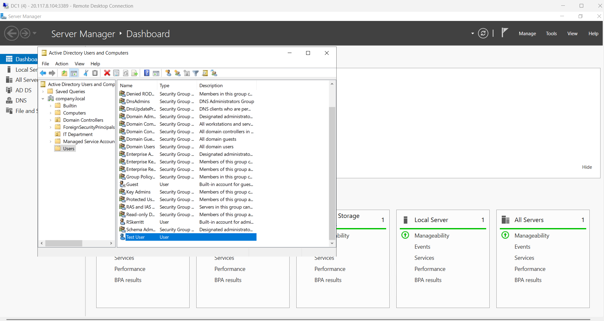
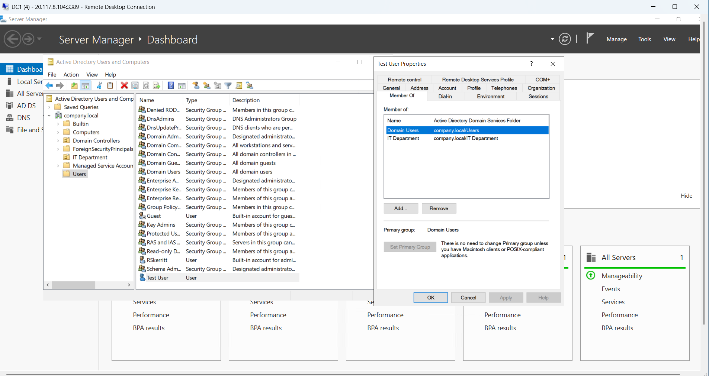
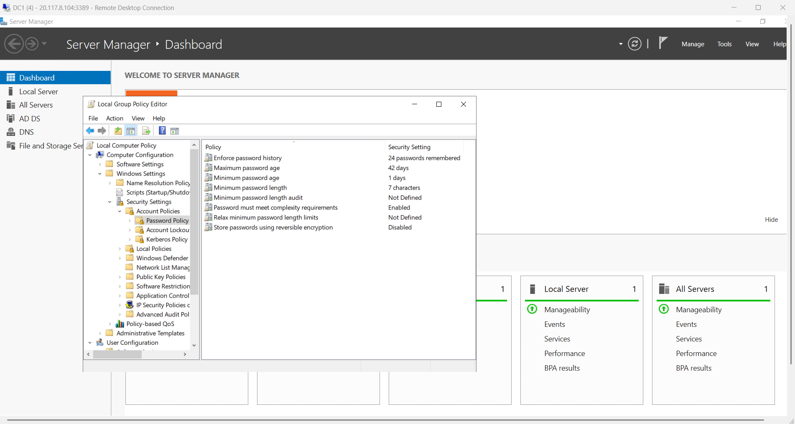

# Common Active Directory Administrative Tasks

## Overview

These tasks demonstrate the day-to-day responsibilities of IT operations and systems administration in an Active Directory environment. Each task represents real-world scenarios that sysadmins handle regularly in enterprise organizations.

---

## Task 1: Reset User Password

### Scenario
A user has forgotten their password and requires immediate access to their account and domain resources. This is the most common help desk ticket in any organization.

### Process

1. **Open Active Directory Users & Computers**
   - Press Windows Key and type `dsa.msc`
   - Press Enter to launch the tool

2. **Locate the User Account**
   - Navigate to the domain (company.local)
   - Find the user in the appropriate container (Users folder or OU)

3. **Reset the Password**
   - Right-click the user account
   - Select **Reset Password**
   - Enter a temporary password
   - Confirm the password

4. **Configure Password Change**
   - Check **"User must change password at next logon"**
   - This forces the user to create their own password on first login (security best practice)

5. **Complete the Reset**
   - Click OK to apply the change
   - The user can now log in with the temporary password and set their own

### Screenshot

### Skills Demonstrated
- User account management
- Password reset procedures
- Security best practices (forced password change)
- Help desk ticket resolution

### Why This Matters
Password resets are the #1 help desk ticket. Any IT support role requires this skill. Knowing how to quickly and securely reset passwords is essential for maintaining user productivity and security.

---

## Task 2: Create New User Account

### Scenario
A new employee joins the company. The IT department needs to create a domain user account for them before their first day so they can access email, file shares, and network resources.

### Process

1. **Open Active Directory Users & Computers**
   - Press Windows Key and type `dsa.msc`
   - Press Enter

2. **Navigate to Users Container**
   - Expand your domain
   - Right-click the **Users** folder

3. **Create New User**
   - Select **New** → **User**
   - This opens the new user creation dialog

4. **Enter User Information**
   - **First name:** (e.g., Test)
   - **Last name:** (e.g., User)
   - **User logon name:** (e.g., testuser.demo)
   - **User logon name (pre-Windows 2000):** Auto-populates based on logon name

5. **Set Password**
   - Enter initial temporary password
   - Confirm password
   - Check **"User must change password at next logon"**

6. **Complete Creation**
   - Click Next and then Finish
   - The user account is now created and can be used to log in to the domain

### Screenshot

### Skills Demonstrated
- User account creation
- Proper naming conventions (first name, last name, username)
- Password configuration
- User provisioning workflows

### Why This Matters
User provisioning is a core sysadmin responsibility. Creating accounts quickly and with proper naming conventions ensures consistency and prevents security issues. Following the "user must change password at next logon" policy ensures users set their own secure passwords.

---

## Task 3: Add User to Security Group

### Scenario
The new employee (Test User) has joined the IT Department and needs access to IT-specific resources and file shares. Users are granted access through membership in security groups, not individual permissions. This is a fundamental principle of enterprise access control.

### Process

1. **Locate the Target Group**
   - In Active Directory Users & Computers
   - Find the group (e.g., IT Department)

2. **Open Group Properties**
   - Right-click the group
   - Select **Properties**

3. **Access Members Tab**
   - Click the **Members** tab
   - This shows all users currently in the group

4. **Add User to Group**
   - Click **Add** button
   - Type the username (e.g., testuser.demo)
   - Click **Check Names** to verify the user exists
   - Click **OK** to add them

5. **Verify Membership**
   - The user now appears in the Members list
   - All group permissions and policies now apply to this user

6. **Apply Changes**
   - Click **OK** to close the Properties dialog

### Screenshot

*Test User Properties showing Member Of tab, confirming Test User is now a member of the IT Department group*

### Skills Demonstrated
- Group membership management
- Access control implementation
- Group-based permission model
- User provisioning completion

### Why This Matters
Group-based access control is the enterprise standard and security best practice. Instead of granting permissions directly to users, permissions are granted to groups, and users are added to groups. This approach:
- **Scalability:** Managing 1,000 users is simple if they're organized in groups
- **Consistency:** All IT Department members automatically get the same permissions
- **Security:** Easier to audit and manage access
- **Efficiency:** One-time configuration of group permissions, not repeated per-user

---

## Task 4: Verify Group Policy Enforcement

### Scenario
After creating users and adding them to groups, verify that Group Policy Objects (GPOs) linked to those groups are actually enforcing the configured policies. This ensures security standards are being applied.

### Process

1. **Open Group Policy Editor**
   - Press Windows Key and type `gpedit.msc`
   - Press Enter to launch Group Policy Editor

2. **Navigate to Password Policy**
   - Expand **Computer Configuration** (left side)
   - → **Windows Settings**
   - → **Security Settings**
   - → **Account Policies**
   - → **Password Policy**

3. **Review Enforced Policies**
   - Examine the configured password policies
   - These settings apply to all users on the domain

4. **Verify Policy Settings**
   - Ensure policies are configured as intended
   - Check that security requirements are being enforced

### Screenshot

### Policy Settings Shown

| Policy | Setting | Purpose |
|--------|---------|---------|
| Enforce password history | 24 passwords remembered | Prevents users from reusing old passwords |
| Maximum password age | 42 days | Forces regular password changes |
| Minimum password length | 7+ characters | Enforces minimum complexity |
| Password must meet complexity requirements | Enabled | Requires mix of character types |

### Skills Demonstrated
- Group Policy understanding
- Security policy configuration
- Group Policy Editor navigation
- Policy enforcement verification
- Security compliance

### Why This Matters
Group Policy is how enterprises enforce security standards at scale. Instead of manually configuring each computer or user, GPOs automatically apply settings to all affected users and computers. This ensures:
- **Consistency:** All users follow the same security standards
- **Scalability:** Policies apply to thousands of users automatically
- **Enforcement:** Policies are applied whether users want them or not
- **Compliance:** Meets security and regulatory requirements

---

## Real-World Application

These four tasks represent the core responsibilities of IT operations:

1. **Password Reset** = Help desk support (reactive)
2. **Create User** = Onboarding/user provisioning (proactive)
3. **Add to Group** = Access management (proactive)
4. **Verify Policy** = Security compliance (verification)

### Workload by Organization Size

**20-person company:**
- 1 sysadmin handles all these tasks manually
- Direct user management approach
- Less formal processes

**500-person company:**
- Specialized roles emerge
- Helpdesk team handles password resets
- User Provisioning team handles onboarding
- IAM (Identity & Access Management) team manages group membership and policies
- Processes become more formal and documented

**5000+ person company:**
- Fully automated workflows for most provisioning
- Identity Governance and Administration (IGA) systems automate group assignments
- Self-service password reset portals for users
- Compliance and audit trails critical
- Multiple administrators focused on specific domains

### Typical Daily Workload (Small-Medium Company)

In a typical day, a sysadmin might:
- Reset 5-10 passwords
- Create 1-2 new user accounts
- Add/remove users from 3-5 groups
- Verify compliance with security policies
- Troubleshoot access issues

---

## Tools Used

- **Active Directory Users & Computers (dsa.msc)** - User and group management
- **Group Policy Editor (gpedit.msc)** - Policy configuration and verification
- **Remote Desktop Protocol (RDP)** - Access to DC1 server

---

## Key Takeaways

✅ Practical hands-on Active Directory administration
✅ Understanding of user and group management
✅ Implementation of group-based access control
✅ Verification of security policy enforcement
✅ Real-world sysadmin workflow demonstration
✅ Enterprise IT operations competency
